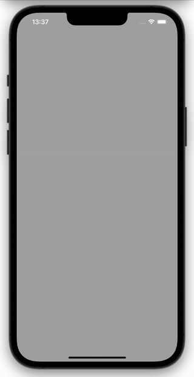
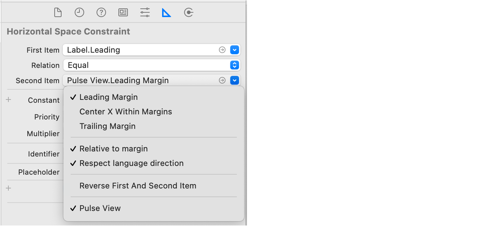
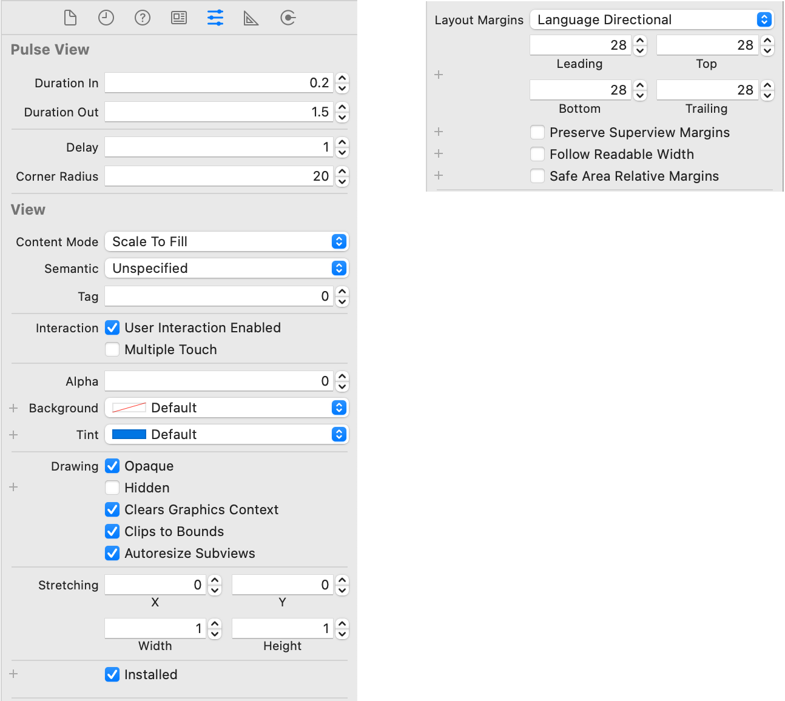
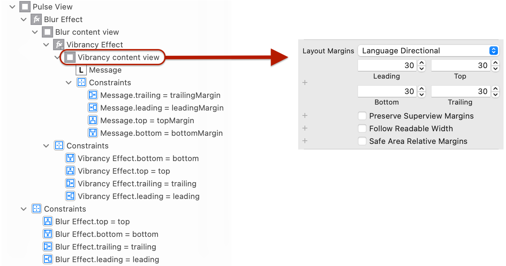

#  Pulse View

A UIView subclass to pulse a message

## Usage

1. Copy the PulseView.swift source file into your Xcode project.

2. On your Storyboard, add a UIView to one of your view controllers and set the class to PulseView.

3. Add subviews to the PulseView. Typically, this would be a UILabel with the message to be pulsed.

4. Set all the necessary Auto Layout constraints for the PulseView and its subviews.

   *Recommendation:* Anchor your subviews to the **layout margins** of the PulseView. (“Relative to margin” in the constraint properties.)
   
   
   
5. Set the properties of the PulseView. (See below.)

6. Ctrl-drag a reference from the PulseView into your view controller’s code.

   *Hint:* Xcode should create an @IBOutlet variable of type `PulseView`. If the type is `UIView`, then you forgot to change the class of the view to PulseView in the Storyboard.

If you are not using a Storyboard, perform steps 2 – 6 in your view controller’s `loadView()` code.

7. In your view controller, call the PulseView’s `.pulse()` method to make the view briefly appear and fade out.

### Properties

- **Duration In:** how long the pulse fades into full view.

- **Duration Out:** how long the pulse fades out.

- **Delay:** how long the pulse stays fully visible.

- **Corner Radius:** rounded corners to get the “capsule” look.

- **Alpha:** set to 0 initially, so the view is hidden until you pulse it.

- **Clips to Bounds:** set to true.

- **Layout Margins:** set to the corner radius + default margin.

  For example, if your corner radius is 20, set the PulseView’s layout margins to 28. Adjust as needed to make your view look good.

   

   
### Visual Effects

If you are using a visual effect (Blur, Vibrancy, etc.), then follow these recommendations:

1. Place the visual effect as a subview of the PulseView.

2. Anchor the effect directly to the PulseView’s top, bottom, leading, and trailing edges. These constraints should **not** be margin-relative. The PulseView’s layout margins aren’t used in this scenario.

3. Place the content (the UILabel) as a subview of the effect’s content view.

   *Hint:* Effects may be nested. For example, a Vibrancy effect inside a Blur effect. The content (label) should be a subview of the innermost effect’s content view.

4. Set the background color of the PulseView and the label to “Default” (Storyboard) or `.clear` (code).

5. Anchor the label to the *margins* of its superview (the effect’s content view).

6. Adjust the layout margins of the effect’s content view so the effect visually surrounds the label.

   *Recommendation:*
   - Corner radius + 10 points.
   - 20 points if there is no corner radius.

   

## PulseView Demo App

1. Download the entire Xcode project.

2. Build and run for the Simulator. (Or a real device, if you add your developer license to the project.)

3. Tap the Pulse button to see the message pulse.
